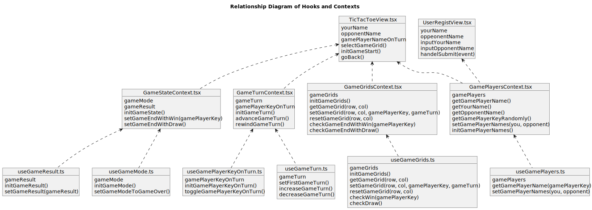
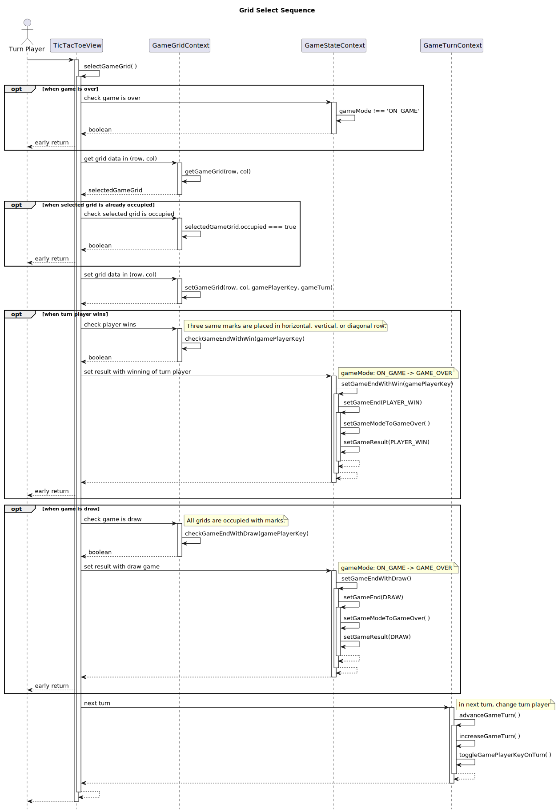

# ○×ゲーム(TicTacToe)

## Atomic Design
#### Pages ("views/")

|   | 物理名         | 論理名               | 説明                             |
|---|----------------|----------------------|----------------------------------|
| 1 | UserRegist.tsx | プレイヤー名入力画面 | あなたと対戦者の名前を入力する画面 |
| 2 | TicTacToe.tsx  | ○×ゲーム画面         | ○×ゲームを行う画面                 |

#### Components ("components/")

|   | 物理名                   | 論理名                           | 説明                                                                                |
|---|--------------------------|----------------------------------|-------------------------------------------------------------------------------------|
| 1 | GameGridsView.tsx        | ゲーム盤表示コンポーネント       | ゲーム盤全体(3x3グリッド)を表示                                                     |
| 2 | GameGridViewView.tsx     | グリッド表示コンポーネント       | ゲーム盤の1グリッドを表示。グリッドの状態(占有・非占有など)によって表示を切り変える |
| 3 | GameModeView.tsx         | ゲームモード表示コンポーネント   | ゲームの状態(対戦中 or ゲーム終了)を表示                                            |
| 4 | GamePlayerOnTurnView.tsx | 手番プレイヤー表示コンポーネント | 手番のプレイヤーの名前を表示                                                        |
| 5 | YouVsOpponentView.tsx    | 名前表示画面                     | あなたと対戦者の名前を表示                                                          |

## React Hooks

#### コンテキスト・カスタムフック関係図

#### Contexts ("contexts/")

|   | 物理名                 | 論理名                 | 説明                                                             |
|---|------------------------|------------------------|------------------------------------------------------------------|
| 1 | GameGridsContext.tsx   | ゲームコンテキスト     | ゲーム盤やグリッドの情報を管理                                           |
| 2 | GamePlayersContext.tsx | プレイヤーコンテキスト | プレイヤーの情報(キー、名前)を管理                                         |
| 3 | GameStateContext.tsx   | 状態コンテキスト       | ゲームの状態(対戦中 or ゲーム終了、勝敗)を管理 |
| 4 | GameTurnContext.tsx    | ターンコンテキスト     | ターンや手番プレイヤーの情報を管理                           |

#### Custom Hooks ("hooks/")

|   | 物理名                    | 論理名           | 説明                                                                 |
|---|---------------------------|------------------|----------------------------------------------------------------------|
|   | useGameGrids.ts           | グリッドフック   | ゲームの盤やグリッドの情報を管理                                     |
|   | useGameMode.ts            | モードフック     | ゲーム中かゲーム終了のフラグ情報を管理                               |
|   | useGamePlayerKeyOnTurn.ts | 手番フック       | 手番プレイヤーの情報を管理                                     |
|   | useGamePlayers.ts         | プレイヤーフック | プレイヤーの情報(キー、名前)を管理                                   |
|   | useGameResult.ts         | 勝敗フック | 勝敗を管理                                   |
|   | useGameTurn.ts            | ターンフック     | ターンの情報を管理                   |
|   | useConstants.ts           | 定数フック       | ゲームに用いる定数を管理(コンテキスト・カスタムフック関係図では割愛) |

## 定数 (in "hooks/useConstants.ts")

|   | 物理名                    | 論理名                     | 説明                                                           |
|---|---------------------------|----------------------------|----------------------------------------------------------------|
| 1 | GAME_PLAYER_KEYS          | プレイヤーのキー情報定数   | あなたと対戦者のキー情報を定義する定数                                 |
| 2 | DEFAULT_GAME_PLAYER_NAMES | デフォルトプレイヤー名定数 | プレイヤー名入力画面の入力欄に初期表示されるプレイヤー名の定数 |
| 3 | GAME_GRIDS                | グリッド情報定数           | ゲーム盤の行と列の最大値と最小値を定義する定数                         |
| 3 | GAME_TURN                 | ターン情報定数             | ターンの初期値や進捗の情報を定義する定数                               |
| 3 | GAME_MODE                 | ゲームモード定数           | ゲームのモード(ゲーム中 or ゲーム終了)を定義する定数             |
| 3 | GAME_RESULT               | 対戦結果定数          | ゲームの対戦結果を定義する定数                                       |
|   |                           |                            |                                                                |

## シーケンス制御

### ゲーム初期化処理

### グリッド選択時

