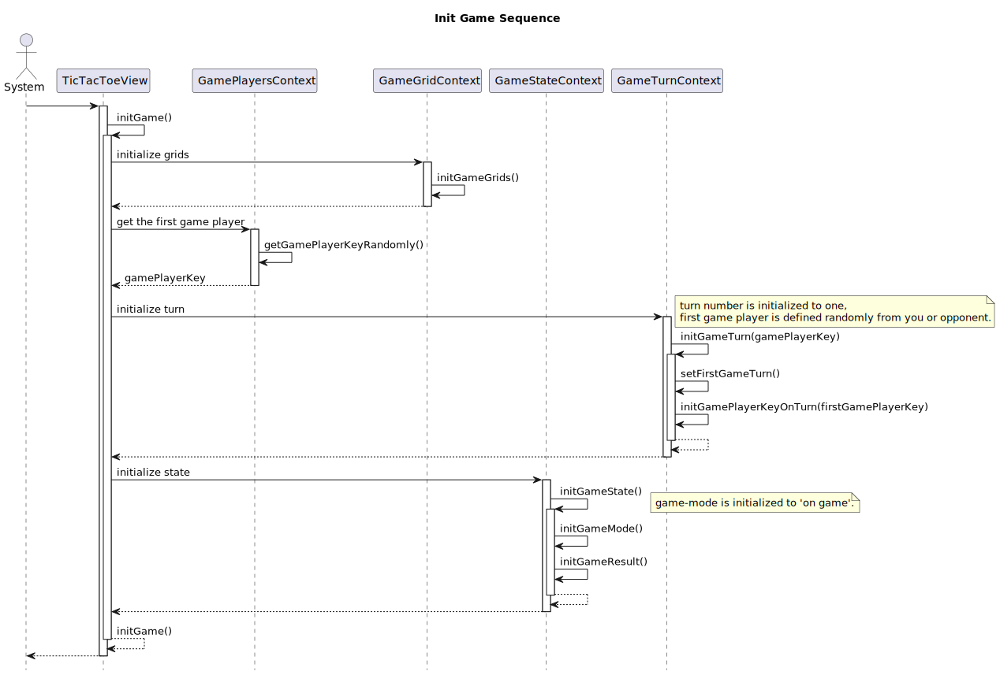

# ○×ゲーム(TicTacToe)

## Atomic Design
#### Pages ("views/")

|   | 物理名         | 論理名               | 説明                             |
|---|----------------|----------------------|----------------------------------|
| 1 | UserRegist.tsx | プレイヤー名入力画面 | あなたと対戦者の名前を入力する画面 |
| 2 | TicTacToe.tsx  | ○×ゲーム画面         | ○×ゲームを行う画面                 |

#### Components ("components/")

|   | 物理名                   | 論理名                                | 説明                                                        |
|---|--------------------------|---------------------------------------|-------------------------------------------------------------|
| 1 | GameGridsView.tsx        | ○×ゲームの盤表示コンポーネント        | ○×ゲームのゲーム盤全体を表示                                |
| 2 | GameGridViewView.tsx     | ○×ゲームの1グリッド表示コンポーネント | ○×ゲームの1マスを表示。占有・非施入によって表示を切り変える |
| 3 | GameModeView.tsx         | ゲームモード表示コンポーネント        | ゲームの状態(対戦中 or ゲーム終了)を表示                                  |
| 4 | GamePlayerOnTurnView.tsx | 手番プレイヤー表示コンポーネント      | あなたと対戦者の名前を表示                                  |
| 5 | YouVsOpponentView.tsx    | 名前表示画面                          | あなたと対戦者の名前を表示                                  |

## React Hooks

#### コンテキスト・カスタムフック関係図

#### Contexts ("contexts/")

|   | 物理名                 | 論理名                 | 説明                                                             |
|---|------------------------|------------------------|------------------------------------------------------------------|
| 1 | GameGridsContext.tsx   | ゲームコンテキスト     | ゲーム盤のデータを管理                                           |
| 2 | GamePlayersContext.tsx | プレイヤーコンテキスト | プレイヤーのデータを管理                                         |
| 3 | GameStateContext.tsx   | 状態コンテキスト       | ゲームの状態(対戦中 or ゲーム終了)などゲームの状態のデータを管理 |
| 4 | GameTurnContext.tsx    | ターンコンテキスト     | ターンや手番のデータを管理                           |

#### Custom Hooks ("hooks/")

|   | 物理名                    | 論理名           | 説明                                                                 |
|---|---------------------------|------------------|----------------------------------------------------------------------|
|   | useConstants.ts           | 定数フック       | ゲームに用いる定数を管理(コンテキスト・カスタムフック関係図では割愛) |
|   | useGameGrids.ts           | グリッドフック   | ゲームの盤やマスを管理                                               |
|   | useGameMode.ts            | モードフック     | ゲーム中かゲーム終了のフラグを管理                                   |
|   | useGamePlayerKeyOnTurn.ts | 手番フック       | 手番を管理                                                           |
|   | useGamePlayers.ts         | プレイヤーフック | プレイヤーの情報を管理                                               |
|   | useGameTurn.ts            | ターンフック     | ターン数や手番のプレイヤーなどターンの情報を管理                     |
|   | useGameSleep.ts           | スリープフック   | スリープ関数を管理                                                   |

## 定数 (in "hooks/useConstants.ts")

|   | 物理名            | 論理名                   | 説明                                                     |
|---|-------------------|--------------------------|----------------------------------------------------------|
| 1 | GAME_PLAYER_KEYS  | プレイヤーのキー情報     | あなたと対戦者のキー情報の定数                           |
| 2 | DEFAULT_GAME_PLAYER_NAMES | デフォルトのプレイヤー名 | プレイヤー名入力画面の入力欄に初期表示されるプレイヤー名の定数 |

## シーケンス制御

### ゲーム初期化処理

### グリッド選択時

